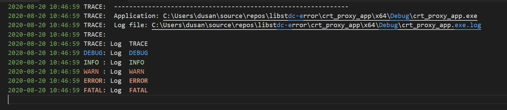

<h1>dbj--simplelog</h1>

**simple, resilient, fast, local log**

> (c) 2019-2020 by dbj.org   -- LICENSE DBJ -- https://dbj.org/license_dbj/ 

- [1. Why logging?](#1-why-logging)
- [2. How to use](#2-how-to-use)
  - [2.1. Setup](#21-setup)
- [3. BIG FAT WARNINGS](#3-big-fat-warnings)
  - [3.1. Do not enter escape codes `\n \v \f \t \r \b`](#31-do-not-enter-escape-codes-n-v-f-t-r-b)
  - [3.2. dbj simple log is not wchar_t compatible](#32-dbj-simple-log-is-not-wchar_t-compatible)
  - [3.3. Alert, I have a name clash?!](#33-alert-i-have-a-name-clash)
  - [3.4. Autoflush](#34-autoflush)
- [4. Building the thing](#4-building-the-thing)

## 1. Why logging?

C/C++ code is used to build software inside the components making a back tier. Without UI and without human presence.

Each data center app or just simply server side app will need to have some logging used. There is no console. And administrators need to see the diagnostic or whichever output from your code.

This is double personality logging; to two targets, all setup depending. Console and a log file. The log file is named equal to full application path + ".log".

Console output is used while testing and debugging. Be sure to switch off console logs in release builds. And of course while developing WIN GUI apps.

Also in here there is a "resilience in presence of multiple threads ", built in.

## 2. How to use

In your code you wish to use `dbj--simplelog`, include `dbj_simple_log.h`. And use these macros:

```cpp
LOG_TRACE(...) ;
LOG_DEBUG(...) ;
LOG_INFO(...)  ;
LOG_WARN(...)  ;
LOG_ERROR(...) ;
LOG_FATAL(...) ;
```

Usage syntax is exactly the same as for the `printf` family, format string and the rest.
```cpp
DBJ_WARN("Temperature is now %d ", current_temp() );
```

If `DBJ_LOG_USE_COLOR` is defined output is coloured, that is default. 



NOTE: above is VS Code view which indeed is coloured. But colors are not the same as on Windows 10 console.

### 2.1. Setup

Setup of `dbj--simplelog` is a compile time affair.  It has to be done, it has to be done exactly once and it is simple but flexible. 

Code where you will do the setup needs to include separate header
```cpp
// ready for setup
#include <dbj_simple_log_host.h>
```
Setup is setup (sic!) by combining the symbols defined in the following table:

| Setup tag  | the effect  | default
|---|---|---| 
 DBJ_LOG_MT | set the Multi Threaded protection | off
DBJ_LOG_TO_FILE  | If app full path is given  use it to obtain log file name | off
DBJ_LOG_FILELINE_SHOW | Include file and line | off
DBJ_LOG_NO_CONSOLE | No console output. Beware, if this is set and no file path is given you will have no logging | false

For your logging needs, you might not like the default settings. You combine the above symbols with "oring" them together (vertical pipe '|' is 'OR'). Whatever you mix in will change the deault setting. Example:
```cpp
// file logging, no console
// what is not mentioned here has a default value
// see the table above
int my_setup = DBJ_LOG_TO_FILE | DBJ_LOG_NO_CONSOLE ;
// note: log file is full app path + '.log'
```

Ditto. In your code in your app, in one and one place only, include `dbj_simple_log_host.h`. In there is a little startup machinery working for you.

Yyou must define one global variable with a desired setup mix. 

```cpp
// dbj_simple_log_host.h
extern int dbj_simple_log_setup_ ;
```
Example usage in your single c or cpp location inside your app:

```cpp
/// single location in your app
/// the mandatory and only initialization of 
/// the dbj simplelog
#include <dbj_simple_log_host.h>

// switch on locking, for the multithreading siutations
// all the other setting are default 
int dbj_simple_log_setup_ = DBJ_LOG_MT ;
```

Thus above setup will result in console output, no log file created or used, and no file and line shown before each line logged.

> Important: log file is newly created on each application run.

That effectively erases the previous log file, if any.

Log file is full app path + '.log'. For example:

```
c:\users\johnson\source\repos\game\game.exe.log
```

**Before exit**

 `dbj_log_finalize()` is declared in the `dbj_simple_log_host.h`. We do not recommend using it. Just leave it. It will be called upon application exit.

## 3. BIG FAT WARNINGS
### 3.1. Do not enter escape codes `\n \v \f \t \r \b` 

Into your strings, you are sending to logging. If you do your output will be strange. And we will not stop you :)

```cpp
// wrong: escape codes
DBJ_INFO("One\nTwo\rThree");
// ok: no escape codes
DBJ_INFO("One Two Three");
```

### 3.2. dbj simple log is not wchar_t compatible

That is not a problem. How? Because Microsoft extension to `printf` family formatting chars has `%S`. That translates strings to/from wide/narrow chars. Example:

```cpp
// some HRESULT indicating error
_com_error  comerr(hr_);
// comerr method ErrorMessage() returns wchar_t *
// It is very simple to log it as a narrow string
// use '%S' not '%s'
dbj_log_fatal("IMMEDIATE EXIT !! '%S'", comerr.ErrorMessage());
```
### 3.3. Alert, I have a name clash?!

And we are not surprised. But don't fret. Macros in the "front" are defined like so:

```cpp
// and these macros in the front
// which are much more senisitive to name clash
// unles you do not use your set
#ifndef DBJ_USER_DEFINED_MACRO_NAMES
	#define LOG_TRACE dbj_log_trace
	#define LOG_DEBUG dbj_log_debug
	#define LOG_INFO dbj_log_info
	#define LOG_WARN dbj_log_warn
	#define LOG_ERROR dbj_log_error
	#define LOG_FATAL dbj_log_fatal
#endif // DBJ_USER_DEFINED_MACRO_NAMES
```
Obviously you can define `DBJ_USER_DEFINED_MACRO_NAMES` and provide your own macro names. Hopefully that's all you need to know to solve the name clash if it happens to your project.

### 3.4. Autoflush

Currently inside `dbj_simple_log.h` there is
```cpp
#define DBJ_SIMPLE_LOG_AUTO_FLUSH
```
Thus we have flush after each write. Safe and slow(er). If really keen you can build your own fork without this defined.

## 4. Building the thing

This is to be built with CL.exe, which in reality means C99, but somewhat undocumented. We also use clang-cl as delivered with Visual Studio 2019.

The rest is history ...

-------

Based on `logc` lib by `rxi`. See the sub folder `logc`.

