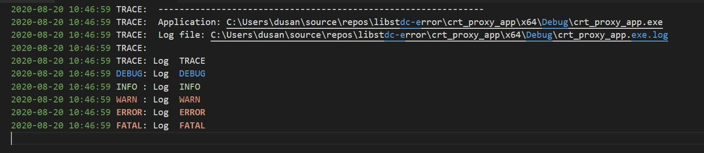

# dbj--simplelog
### simple resilient fast local log

> (c) 2019-2020 by dbj.org   -- LICENSE DBJ -- https://dbj.org/license_dbj/ 

Double personality logging. By default all the log goes to 
the console through `stderr`, **and** to the local file named equal to full application path + ".log".
Also there is resilience in presence of threads "built in".

> Important: log file is reset on each application run. That is the current policy.

It is on the **roadmap** to offer several setup combinations to use on startup. Including log file opening options

## How to use

Through these macros

```cpp
log_trace(...) ;

log_debug(...) ;

log_info(...);

log_warn(...);

log_error(...) ;

log_fatal(...) ;
```

Usage syntax is exactly the same as for the `printf` family, format string.

If `DBJ_LOG_USE_COLOR` is defined output is coloured. By default it is.



NOTE: above is VS Code view which indeed is coloured. But colors are not the same as on Windows 10 console.

### You need to start it
On start-up one can use the set-up function `dbj_log_setup`. But we recommend to use the `dbj_simple_log_startup(const char* app_full_path)` 
immediately after main() starts.

```cpp
int main( const int argc, char * argv[] )
{
    if (EXIT_SUCCESS != dbj_simple_log_startup(argv[0]))
        return EXIT_FAILURE;

// log file is named equal to argv[0] + ".log".
    const char * lfp = current_log_file_path();

 ... the rest of the main ...

```
### How to end properly

This is a Windows lib. And Windows is notorious for being very reluctant to flush. Thus please make sure at application end
you place this snippet, (somewhere clever as you do):

```cpp
        FILE* fp_ = dbj_fhandle_log_file_ptr(NULL);
        assert(fp_);
        (void)_flushall();
         // make sure it is fclose, not close
        if (fp_) { fclose(fp_); fp_ = nullptr; }
```

> You must flush to see the log file contents eventually. 

**Roadmap** is to encapsulate this solution inside the library.


## Setup options

| Setup tag  | the effect  |
|---|---|
 DBJ_LOG_MT | set the Multi Threaded protection
DBJ_LOG_VT100  | switch on the VT100 console mode, if no coloured output 
DBJ_LOG_TO_APP_PATH  | If app full path is given  use it to obtain log gile name. Make sure you use absolute paths.
DBJ_LOG_FILE_LINE_OFF | Exclude file and line, from time stamp 
DBJ_LOG_NO_CONSOLE | No console output. Beware, if this is set and no file path is given you will have no logging. 


## Building

Built with CL.exe, which in reality means C99, but somewhat undocumented. **Roadmap** is to switch to clang 10.x and use C11 goodies.

How to use: best add it as a git submodule. Include `dbj_simple_log.h` 
Include it's only C file  `dbj_simple_log.c` in your project. Use.

-------

Based on `logc` lib by `rxi`. See the sub folder `logc`.

